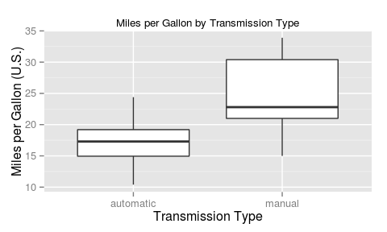
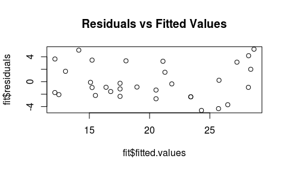
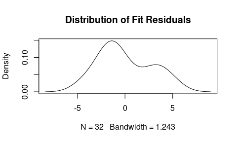

# Is an Automatic or Manual Transmission Better for Miles per Gallon?
Matthew Sedlar  
October 23, 2015  

## Executive Summary

This paper looks at data extracted from the 1974 *Motor Trend* U.S. magazine and attempts to answer whether an automatic or manual transmission is better for miles per gallon. It attempts to explain the advantage manual transmissions have over automatic transmittions by fitting a regression model to the dependent variable, mpg, using the independent variables transmission type and the size and power of a vehicle's engine. The result is that better mpg in cars with manual transmissions can be explained by the relationship between gas usage and engine displacement, but only for the sample provided as it is small and dated.

## Exploratory Analysis

The data consists of aspects of automobile design and performance for 32 automobiles (1973–74 models). I started by looking at simple box plot of miles per gallon by automatic and manual transmission types. As figure 1 shows, the interquartile range for automatic transmissions is below the interquartile range of manual transmissions. There certainly appears to be a relationship between better mpg and manual transmissions.

#### Figure 1

While the difference between the average mpg for the transmission types is statistically significant with a p-value of 0.0013736, a simple categorical variable cannot fully explain _why_ there is a difference. We have to explore other variables that can help explain why.

There are several candidates to choose from, including weight, number of cylinders, horsepower, displacement, and number of carburetors (see Appendix A). Several of these variables have something in common: the size and power of the engine. 

## Fitting a Model

Displacement is [defined](http://askcars.com/2008/07/what-does-engin.html) as the volume of an engine's cylinders, generally an indicator of the engine's size and power. The displacement variable not only correlates with the weight of a car (0.8879799), but also shares a correlation with the number of cylinders (0.9020329) and horsepower (0.7909486). For this reason I chose to fit a model using displacement to explain the advantage manual cars appear to have over automatic transmissions.

A residual analysis (see Appendix B) shows that the fit is an appropriate model and the equal variability and normality assumptions have not been violated. 

As the coefficients below show, with significance, for each increase in displacement by one cubic inch, there's a decrease in mpg by 0.028 and 0.059 for automatic and manual transmissions respectively.

                         Estimate   Std. Error   t value   Pr(>|t|)
----------------------  ---------  -----------  --------  ---------
(Intercept)                25.157        1.925    13.068      0.000
disp                       -0.028        0.006    -4.435      0.000
factor(am)manual            7.709        2.503     3.080      0.005
disp:factor(am)manual      -0.031        0.011    -2.745      0.010

This is illustrated in Figure 2, which also shows that very few cars with manual transmissions exist beyond the average displacement and the two that do have leverage on the regression line (see Appendix C).

#### Figure 2

## Conclusion

The model I picked infers that manual transmissions have better miles per gallon because of the relationship between gas usage and the size and power of the engine. As the displacement (in cubic inches) increases, the efficiency in mpg drops for both transmission types. Essentially, big cars have larger engines and generally have worse mpg. With the exception of two cars in the data set, the cars with worse mpg are automatic. 

The problem with this inference is that it not only relies on a small data set, but the data is outdated. Really, the conclusion only applies to 32 models from 1973-1974. It's difficult to draw a conclusion about a population from a sample that is not representative of what people currently drive. I would need a larger, up-to-date data set to make a proper inference about mpg in current models.

\pagebreak

# Appendix

### A: Independent Variables by MPG, Faceted by Transmission Type

 

### B: Residual Analysis

Figure B1 shows the fitted values of the model plotted against the residuals and finds no apparent relationship or pattern between the two. The residuals appear to be evenly spread above and below 0.  

#### Figure B1

Figure B2 shows the distribution of residuals to be approximately normal; however, the small sample size should be noted. 

#### Figure B2

### C: Leverage

Two cars in the manual transmission group, the Maserati Bora and Ford Pantera L, exert a significant amount of leverage on the regression line. As the hat values below show, both are considerable outliers.

---------------  -----
Mazda RX4         0.08
Mazda RX4 Wag     0.08
Datsun 710        0.09
Fiat 128          0.12
Honda Civic       0.13
Toyota Corolla    0.13
Fiat X1-9         0.12
Porsche 914-2     0.08
Lotus Europa      0.10
Ford Pantera L    0.55
Ferrari Dino      0.08
Maserati Bora     0.35
Volvo 142E        0.08
---------------  -----

By removing the two, and resetting the regression model, the coefficients now show each increase in one cubic inch of displacement is accompanied by a decrease in mpg by 0.1352438 (as illustrated in Figure C1 below).

\pagebreak

#### Figure C1

